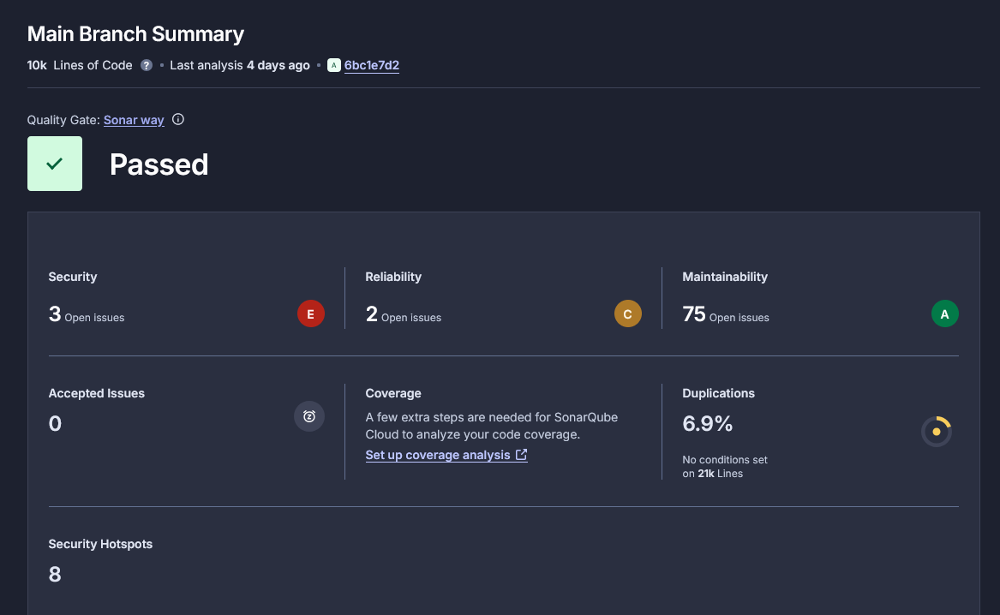
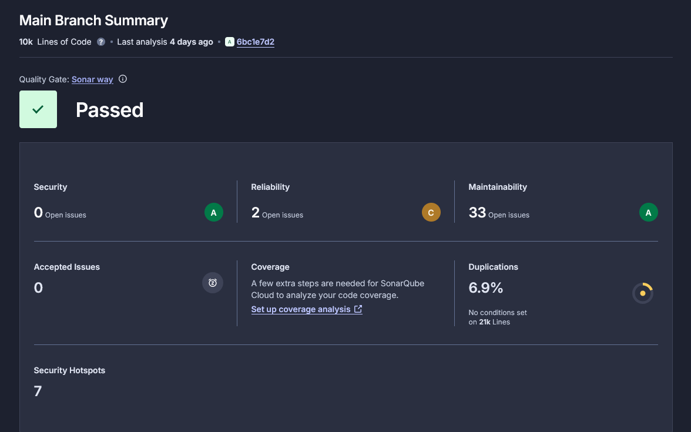
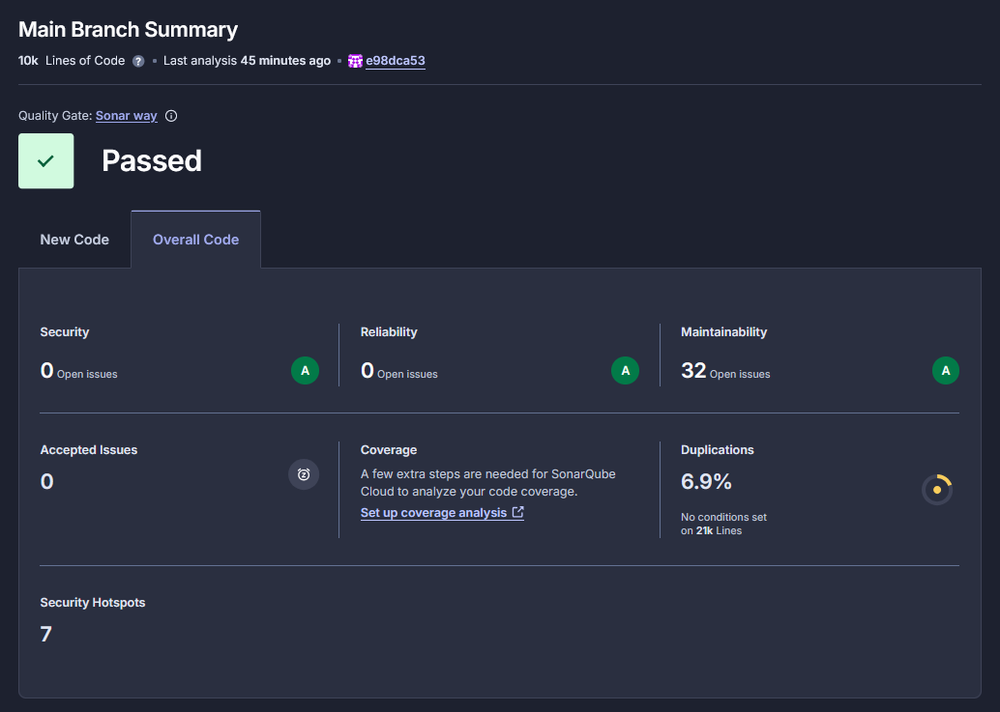
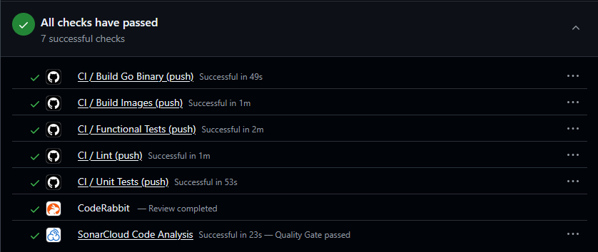

# Звіт результатів SonarCloud

## До рефакторингу

### Трохи почистивши False Positives, маємо наступне:

## Після рефакторингу

## Обрані метрики

| Метрика             | До     | Після |
|---------------------|--------|:-----:|
| Reliability         | 2, C   | 0, A  |
| Maintainability     | 33, A  | 30, A |

### Застосовувались наступні патерни: 
- **Replace Magic Number** – прибрано магічні числа, що стосувалися секретного ключа та термінів придатності JSON Web Token
- **Simplify Conditional** - перетворення складної логіки на простішу

## Перевірка регресії

*З нового pull request-у після рефакторингу.