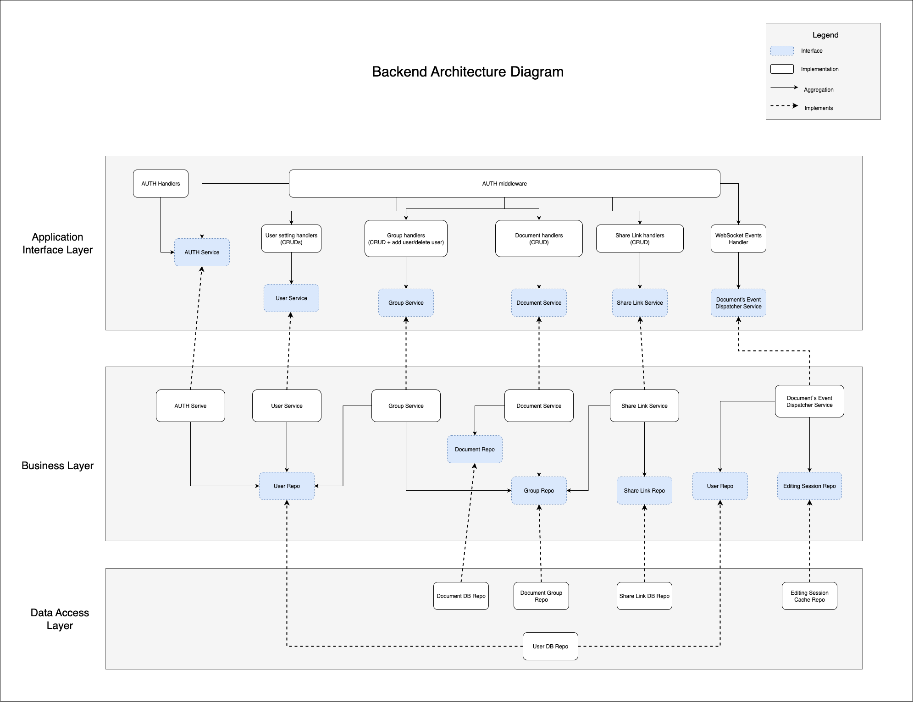

# System Design: Markdown Circus Docs

MCD - це веб-застосунок для спільного створення та редагування документів у форматі Markdown.
Основна ціль забезпечити можливість спільного редагування у реальному часі (швидка синхронізація змін).
Важливою частиною буде зручність використання додатку - це включає створення груп, ролі користувачів, коментарі та версіонування.

## Функціональні вимоги

### FR-001: Пошук документів

- **Опис:** Система повинна надавати можливість пошуку серед документів користувача
- **Посилання на User Story:** [US-001: Пошук серед документів](user-stories.md#us-001-пошук-серед-документів)

### FR-002: Версіонування документів

- **Опис:** Система повинна автоматично створювати версії документів та надавати можливість їх перегляду та відновлення
- **Посилання на User Story:** [US-002: Історія версій](user-stories.md#us-002-історія-версій)

### FR-003: Гостовий доступ до документів

- **Опис:** Система повинна надавати можливість доступу до документів без реєстрації через спеціальні посилання
- **Посилання на User Story:** [US-003: Використання застосунку без реєстрації](user-stories.md#us-003-використання-застосунку-без-реєстрації)

### FR-004: Спільне редагування в реальному часі

- **Опис:** Система повинна забезпечувати синхронне редагування документів кількома користувачами одночасно
- **Посилання на User Story:** [US-004: Редагування документу](user-stories.md#us-004-редагування-документу)

### FR-005: Управління групами документів

- **Опис:** Система повинна надавати можливість створення та управління групами документів
- **Посилання на User Story:** [US-005: Групи та керування ними](user-stories.md#us-005-групи-та-керування-ними)

### FR-006: Система ролей та прав доступу

- **Опис:** Система повинна надавати різні ролі користувачів з відповідними правами доступу
- **Посилання на User Story:** [US-006: Ролі у групі](user-stories.md#us-006-ролі-у-групі)

### FR-007: Поширення документів

- **Опис:** Система повинна надавати можливість створення та управління посиланнями для поширення документів
- **Посилання на User Story:** [US-007: Поширити документ](user-stories.md#us-007-поширити-документ)

### FR-008: Експорт документів

- **Опис:** Система повинна надавати можливість експорту документів у різних форматах
- **Посилання на User Story:** [US-008: Експорт документу](user-stories.md#us-008-експорт-документу)

## Не функціональні вимоги

### NFR-001: Продуктивність - Час відповіді

- **Категорія ISO 25010:** Performance Efficiency / Time Behaviour
- **Опис:** Швидка синхронізація змін в документі в реальному часі
- **Метрика:**
  - 95 % часу завантаження < 2 секунди
  - 99 % часу завантаження < 4 секунди
- **Умови тестування:**
  - Швидкість інтернету: 100 Mbps
  - Одночасних користувачів в документі: 4

### NFR-002: Надійність - Відновлюваність

- **Категорія ISO 25010:** Reliability / Recoverability
- **Опис:** Регулярне збережання поточного стану документу
- **Метрика:**
  - Кожні >= 100 доданих, видалених або змінених символів. Або кожні 5 хвилин, якщо > 0 і < 100
- **Умови тестування:**
  - Звичайне користування або імітація розриву з'єднання, раптового закриття браузера

### NFR-003: Зручність використання - Керованість

- **Категорія ISO 25010:** Interaction Capability / Operability
- **Опис:** Швидкий початок роботи над документом
- **Метрика:**
  - в < 4 кліки
- **Умови тестування:**
  - Авторизований або неавторизований користувач
  - За посиланням (кодом) або з головного меню

## Діаграма компонентів бекенду

## Діаграма розгортання

